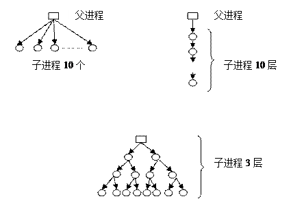

# 实验一 并发程序设计

## 实验目的

​    加深对进程的创建、运行、撤销过程的直观认识；

掌握通过操作系统的用户接口（命令行和系统函数）控制进程状态的方法；

​    了解多进程在多核处理机上的并发执行过程；

## 实验内容

​    可以使用Linux或其它Unix类操作系统；

​    学习该操作系统提供的命令行启动、撤销进程的方法；

​    学习该操作系统提供的系统调用接口（借助于库函数的形式间接调用）启动和撤销进程；

​    利用该操作系统提供的工具观测这些程序的并发执行过程以及状态转换过程。

## 实验环境

​    硬件：桌面PC

​    软件：Linux 或其他操作系统

## 实验步骤及说明

预备部分：

​    学习top、ps、pstree和kill等命令的使用。能通过top和ps j命令查看进程号、父进程号、可执行文件名（命令）、运行状态信息，能通过pstree查看系统进程树；能通过kill命令杀死制定pid的进程。

学习/proc/PID/maps的输出信息。

了解/porc/PID/status中各项内容的。

 

操作部分（1/2/3/5/每点完成度各计20%）：

1） 使用fork()创建子进程，形成以下父子关系：

 

要求：并通过/proc文件系统，检查进程的pid和ppid证明你成功创建相应的父子关系，并用pstree验证其关系。

 

2） 编写代码实现孤儿进程，用pstree查看孤儿进程如何从原父进程位置转变为init进程所收养的过程；编写代码创建僵尸进程，用ps j查看其运行状态。

 

要求：用Linux系统提供的信息，展示并记录上述进程状态及变化

 

3） 创建多个线程，在各个线程中打印出堆栈变量的地址。

 

要求：比较各线程的/proc/PID/maps是否相同。检查主线程的堆栈和其他线程堆栈位置在/proc/PID/maps所对应的位置差异。

 

4） 分别创建相同数量的进程和线程

 

要求：比较进程控制块开销的差异、内存vma描述符开销的差异，并简要解释原因。

 

5） 尝试自行设计一个C语言小程序，完成最基本的shell角色

 

要求：给出命令行提示符、能够逐次接受命令；对于命令分成三种，内部命令（实现help命令给出用法、exit命令退出shell）、外部命令（即磁盘上的可执行文件）以及无效命令（不是上述两种命令）。

 

实验报告要求：

1） 按学校统一格式

2） 需要给出具体命令和自行编写的程序的源代码

3） 需要给出实验操作的截图和必要的说明文字

 